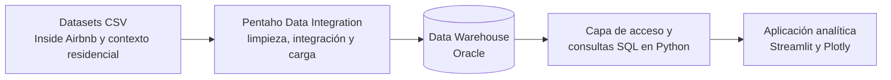
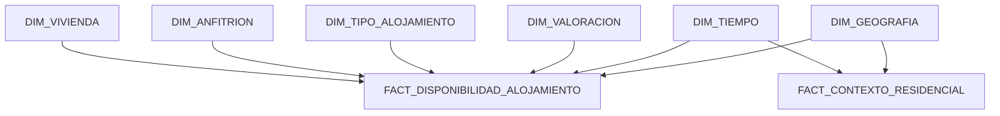

# Análisis de viviendas turísticas en ciudades españolas

Proyecto desarrollado como Trabajo Fin de Máster para diseñar e implementar una solución de inteligencia de negocio aplicada al mercado de viviendas turísticas. El sistema integra datos de Málaga, Sevilla, Valencia y Madrid, los organiza en un Data Warehouse dimensional y los presenta mediante una aplicación analítica interactiva.

El repositorio reúne el ciclo completo del dato: datasets de origen, definición del modelo Oracle, procesos ETL en Pentaho Data Integration, capa de consultas analíticas y visualización web.

## Objetivo

El proyecto busca convertir datos heterogéneos sobre alojamientos turísticos y contexto residencial en información comparable y útil para analizar:

- la distribución y concentración territorial de la oferta turística;
- los precios publicados y el ingreso potencial asociado;
- la disponibilidad y su comportamiento temporal;
- las características y capacidad de los alojamientos;
- el perfil y nivel de profesionalización de los anfitriones;
- las valoraciones y el volumen de reseñas;
- la relación entre vivienda turística, alquiler residencial e indicadores socioeconómicos.

El alcance geográfico comprende cuatro de los principales destinos urbanos españoles: **Málaga, Sevilla, Valencia y Madrid**.

## Arquitectura de la solución



La solución separa claramente las responsabilidades:

1. **Fuentes de datos:** ficheros de anuncios, calendarios, barrios e indicadores residenciales.
2. **Integración:** transformaciones Pentaho que limpian, normalizan y relacionan las fuentes.
3. **Persistencia:** modelo dimensional implementado en Oracle.
4. **Explotación:** consultas SQL especializadas para cada línea de análisis.
5. **Presentación:** cuadros de mando, mapas, indicadores y gráficos interactivos.

## Fuentes y datasets

Los datos turísticos siguen la estructura publicada por **Inside Airbnb**. Para cada ciudad se incluyen tres conjuntos:

| Dataset | Contenido principal |
|---|---|
| `listings.csv` | Identificación del anuncio, vivienda, anfitrión, tipología, capacidad, precio y valoraciones. |
| `calendar.csv` | Disponibilidad y precio diario por alojamiento. |
| `neighbourhoods.csv` | Organización territorial por distrito y barrio. |

El fichero `contexto_residencial.csv` reúne indicadores agregados de alquiler habitual, renta, ingresos, parque residencial, viviendas turísticas y capacidad turística. Su finalidad es enriquecer el análisis puramente turístico con una perspectiva residencial y socioeconómica.

Los ficheros se conservan por ciudad para mantener la trazabilidad de origen antes de su integración en el Data Warehouse.

## Modelo dimensional

El Data Warehouse utiliza un esquema dimensional con dos procesos de negocio relacionados.



### Dimensiones

| Tabla | Información representada |
|---|---|
| `DIM_VIVIENDA` | Identidad del anuncio, nombre, URL, licencia, fuente y coordenadas. |
| `DIM_ANFITRION` | Datos del anfitrión, tasas de respuesta, condición de superhost y perfil de actividad. |
| `DIM_TIPO_ALOJAMIENTO` | Tipo de propiedad y habitación, capacidad, dormitorios, baños, camas y comodidades. |
| `DIM_TIEMPO` | Fecha, componentes del calendario, trimestre, día de la semana y temporada. |
| `DIM_GEOGRAFIA` | País, comunidad autónoma, provincia, ciudad, distrito y barrio. |
| `DIM_VALORACION` | Puntuaciones, volumen de reseñas y disponibilidad de reserva instantánea. |

### Tablas de hechos

| Tabla | Granularidad y métricas |
|---|---|
| `FACT_DISPONIBILIDAD_ALOJAMIENTO` | Una observación por vivienda y día, con disponibilidad, precios, restricciones de estancia e ingreso potencial diario. |
| `FACT_CONTEXTO_RESIDENCIAL` | Indicadores residenciales agregados por ámbito geográfico y periodo temporal, incluido el índice de presión turística. |

El script [init_oracle_dw_airbnb.sql](sql/init_oracle_dw_airbnb.sql) contiene la definición del modelo, sus claves primarias y foráneas, restricciones de integridad, índices y comentarios descriptivos.

## Proceso ETL

El proceso de integración se ha construido con Pentaho Data Integration a partir de ocho transformaciones. Primero se cargan todas las dimensiones y posteriormente las tablas de hechos, que resuelven sus claves subrogadas mediante lookups.

```text
DIM_GEOGRAFIA
      ↓
DIM_TIEMPO
      ↓
DIM_VIVIENDA
      ↓
DIM_ANFITRION
      ↓
DIM_TIPO_ALOJAMIENTO
      ↓
DIM_VALORACION
      ↓
FACT_CONTEXTO_RESIDENCIAL
      ↓
FACT_DISPONIBILIDAD_ALOJAMIENTO
```

Entre las operaciones realizadas se encuentran:

- integración de los ficheros de las cuatro ciudades;
- selección y normalización de campos;
- tratamiento de porcentajes, indicadores booleanos y precios;
- generación de atributos temporales;
- clasificación de anfitriones y valoraciones;
- cálculo del número de comodidades;
- unión de anuncios y calendarios;
- cálculo de presión turística e ingreso potencial;
- resolución de claves dimensionales antes de cargar los hechos.

El job maestro `carga_datawarehouse.kjb` controla la secuencia completa e impide que las facts se procesen cuando falla una dimensión previa. El inventario de transformaciones y la secuencia de carga se resumen en la [documentación de Pentaho](pentaho/README.md).

## Aplicación analítica

La capa de explotación está desarrollada en Python. Las consultas se organizan por dominio y alimentan una aplicación multipágina construida con Streamlit, Plotly y PyDeck.

| Área | Análisis disponibles |
|---|---|
| Visión general | Volumen de viviendas, ciudades, precios, noches analizadas, disponibilidad e ingreso potencial. |
| Concentración territorial | Peso de la oferta por ciudad y barrio. |
| Ingreso potencial | Comparación territorial de precios e ingresos derivados de la disponibilidad publicada. |
| Estacionalidad | Disponibilidad y ocupación estimada por temporada y mes. |
| Distribución espacial | Mapa interactivo de viviendas con información descriptiva y filtros geográficos. |
| Tipología | Composición de la oferta por tipo de propiedad, habitación y capacidad. |
| Anfitriones | Superhosts, principales operadores y perfiles según número de anuncios. |
| Valoraciones | Puntuaciones, volumen de reseñas, reserva instantánea y relación con el precio. |
| Contexto residencial | Comparación de la actividad turística con alquiler e indicadores residenciales. |

La capa SQL utiliza parámetros enlazados para los filtros y mantiene separada la lógica de consulta de la presentación visual. El repositorio también incluye pruebas automatizadas sobre consultas, transformaciones auxiliares y traducción de etiquetas.

## Estructura del repositorio

```text
proyecto_tfm/
├── app.py                 # Punto de entrada de la aplicación analítica
├── backend/
│   ├── db.py              # Acceso a Oracle y ejecución de consultas
│   └── queries/           # Consultas organizadas por dominio analítico
├── frontend/              # Componentes, gráficos, mapas y vistas
├── pages/                 # Páginas temáticas de la aplicación
├── data/                  # Datasets de entrada por ciudad
├── sql/
│   └── init_oracle_dw_airbnb.sql
├── pentaho/
│   ├── jobs/              # Job maestro
│   ├── transformations/   # Transformaciones ETL
│   └── README.md          # Descripción del proceso ETL
├── tests/                 # Pruebas automatizadas
└── requirements.txt       # Dependencias de la capa analítica
```

## Tecnologías utilizadas

- **Oracle Database** para el almacenamiento dimensional y la integridad referencial.
- **Pentaho Data Integration** para los procesos de extracción, transformación y carga.
- **Python y pandas** para el acceso y preparación de resultados analíticos.
- **Streamlit** para la aplicación web multipágina.
- **Plotly y PyDeck** para gráficos y visualizaciones geoespaciales.
- **Pytest** para las pruebas automatizadas.

## Consideraciones metodológicas

- La disponibilidad publicada no equivale necesariamente a ocupación real. Las métricas de ocupación derivadas deben interpretarse como estimaciones.
- El ingreso potencial se calcula a partir de precios y disponibilidad observados; no representa facturación real ni incorpora todas las comisiones, impuestos o cancelaciones.
- Los resultados corresponden al periodo cubierto por los datasets y no deben extrapolarse automáticamente a otros periodos.
- Las comparaciones residenciales dependen del nivel de agregación y de la fecha de referencia del fichero de contexto.
- Los datos originales pueden contener valores ausentes, diferencias semánticas entre ciudades y cambios en la estructura publicada por la fuente.

El flujo de transformaciones se describe también en [pentaho/README.md](pentaho/README.md), manteniendo diferenciadas la visión global del proyecto y la documentación específica del proceso ETL.

## Resultado del proyecto

El resultado es una solución integral de Business Intelligence que conecta la ingeniería de datos con el análisis visual. El modelo permite estudiar conjuntamente la dimensión espacial, temporal, económica y operativa de la vivienda turística, conservando la trazabilidad desde los CSV de origen hasta los indicadores mostrados en la aplicación.
